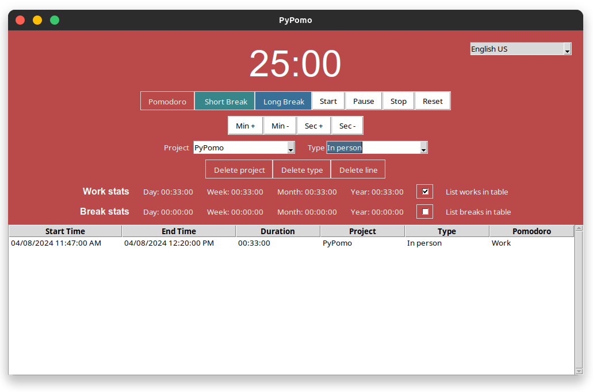

# PyPomo - Pomodoro Tracker with Excel Integration

## Features

**PyPomo** is a Python-based Pomodoro timer and tracking application designed to boost productivity using the Pomodoro technique. It uniquely integrates with Excel for in-depth data analysis.

### Excel Data Storage
- **Comprehensive Data Logging**: Logs every session with detailed info.
- **Detailed Analysis**: Data stored in Excel for personal productivity analysis.
- **Data Manipulation and Reporting**: Direct manipulation in Excel for custom insights.

### Customizable Timer
- **Adjustable Duration**: Customize timer for Pomodoro, short, and long breaks.
- **Manual Time Adjustments**: Flexibility to adjust timer on the go.

### User Interface and Experience
- **Intuitive Interface**: Simple, user-friendly interface for easy operation.
- **Dynamic Backgrounds**: Background color changes with the timer mode.

### Project and Type Tracking
- **Project and Type Management**: Assign sessions to specific projects and types.
- **Dynamic Dropdowns**: Real-time updates in project and type selections.

### Additional Functionalities
- **Data Deletion and Management**: Easy deletion of projects, types, or entries.
- **Alarm Notification**: Alerts at the end of each session.
- **Modal Warnings**: Custom warnings for enhanced user interaction.

### Future Enhancements
- **Translations**: To support multiple languages.
- **Interactive Stats Page**: For a visual productivity dashboard.

## License
PyPomo is available under the MIT License.

## Installation and Setup
- Requires Python, `tkinter`, `pygame`, `pandas`, `openpyxl`.
- Clone the repo and run the script to start.

## Demo

Enhance your productivity with detailed work pattern analysis using PyPomo!

